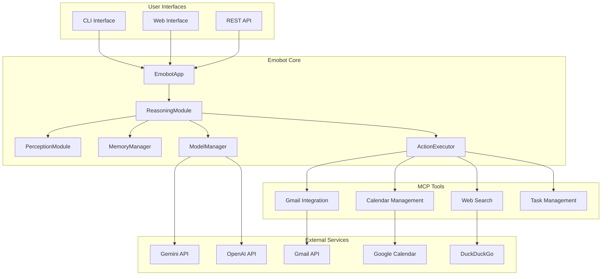
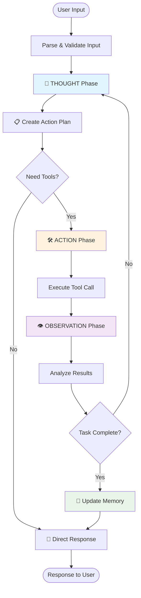

# Emobot - Intelligent ReAct Assistant

<div align="center">


*An intelligent assistant implementing the ReAct (Reasoning + Acting) framework for enhanced AI reasoning and multi-tool integration capabilities*

</div>

## Table of Contents

- [Project Overview](#project-overview)
- [Key Distinctions](#key-distinctions)
- [Real-World Applications](#real-world-applications)
- [System Architecture](#system-architecture)
- [ReAct Workflow](#react-workflow)
- [Quick Start](#quick-start)
- [Usage Examples](#usage-examples)
- [Configuration](#configuration)
- [Web Interface](#web-interface)
- [Development](#development)
- [Contributing](#contributing)
- [License](#license)

## Project Overview

Emobot represents a significant advancement in AI assistant technology, moving beyond simple conversational interfaces to deliver actionable intelligence through systematic reasoning and tool integration. Unlike traditional chatbots that provide static responses, Emobot employs the ReAct (Reasoning + Acting) framework to break down complex problems, execute real-world actions, and learn from outcomes.

The system addresses critical limitations in current AI assistants:
- **Limited actionability**: Most AI systems can only provide information, not execute tasks
- **Fragmented workflows**: Users must manually coordinate between different tools and services
- **Context loss**: Traditional systems fail to maintain coherent state across multi-step operations
- **Reactive responses**: Lack of proactive planning and systematic problem-solving approaches

Emobot bridges these gaps by providing a unified interface that can reason through problems, coordinate multiple tools, and maintain context throughout complex workflows.

## Key Distinctions

### Intelligent Tool Orchestration

What sets Emobot apart is its sophisticated approach to tool integration and decision-making. Rather than simply executing individual commands, Emobot employs strategic reasoning to determine optimal tool combinations and execution sequences.

**Dynamic Tool Selection**: The system analyzes each task to identify the most appropriate tools and their optimal usage patterns. For example, when asked to "research competitors and schedule a follow-up meeting," Emobot:

1. **Analyzes requirements**: Identifies need for web search, data synthesis, and calendar management
2. **Plans execution sequence**: Determines that research must precede scheduling
3. **Coordinates tools**: Executes web search, processes results, then interfaces with calendar API
4. **Validates outcomes**: Confirms successful completion of each step before proceeding

**Context-Aware Integration**: Unlike systems that treat each tool interaction independently, Emobot maintains contextual awareness across tool boundaries. Information gathered from one tool informs the parameters and approach for subsequent tools, creating coherent workflows.

**Adaptive Decision Making**: The system continuously evaluates tool performance and adjusts strategies based on results. If a web search yields insufficient information, Emobot automatically refines search terms or explores alternative information sources.

### Multi-Step Reasoning Engine

Emobot's reasoning capabilities extend beyond simple task execution to encompass complex problem decomposition and strategic planning:

**Hierarchical Task Breakdown**: Complex requests are systematically decomposed into manageable subtasks, each with clear success criteria and dependencies.

**Causal Reasoning**: The system understands cause-and-effect relationships between actions, enabling it to predict outcomes and plan accordingly.

**Error Recovery**: When tool executions fail or produce unexpected results, Emobot can diagnose issues and implement alternative approaches without user intervention.

### Persistent Memory Architecture

The system maintains sophisticated memory structures that enable continuity across sessions and learning from past interactions:

**Episodic Memory**: Detailed records of past interactions, including successful strategies and failure modes
**Semantic Memory**: Accumulated knowledge about user preferences, common workflows, and domain-specific information
**Working Memory**: Active maintenance of current task context and intermediate results

## Real-World Applications

### Enterprise Productivity Enhancement

**Executive Assistant Automation**: Emobot serves as a comprehensive digital assistant for executives and knowledge workers, handling complex multi-step workflows that traditionally require human coordination. The system can simultaneously manage email communications, schedule optimization, research tasks, and follow-up actions.

**Research and Analysis Workflows**: For professionals requiring comprehensive market research, competitive analysis, or technical investigation, Emobot provides end-to-end automation. The system can gather information from multiple sources, synthesize findings, generate reports, and distribute results to stakeholders.

**Project Management Integration**: Beyond simple task tracking, Emobot integrates with existing project management ecosystems to provide intelligent workflow automation, deadline monitoring, and resource coordination.

### Business Process Automation

**Customer Relationship Management**: Emobot can monitor customer communications, identify priority issues, draft responses, and coordinate follow-up actions across multiple channels and systems.

**Data Integration and Reporting**: The system excels at gathering data from disparate sources, performing analysis, and generating actionable insights with minimal human intervention.

**Compliance and Documentation**: For organizations with complex compliance requirements, Emobot can automate documentation processes, monitor regulatory changes, and ensure adherence to established protocols.

### Personal Productivity Solutions

**Intelligent Life Management**: Beyond simple scheduling, Emobot provides comprehensive life management including travel planning, financial monitoring, health appointment coordination, and personal goal tracking.

**Learning and Development**: The system can create personalized learning plans, gather relevant educational resources, schedule study sessions, and track progress across multiple domains.

**Home and Family Coordination**: For busy families, Emobot can coordinate schedules, manage household tasks, monitor important deadlines, and facilitate communication between family members.

## Core Features

### Advanced Reasoning Engine
- **ReAct Loop**: Implements the Reasoning + Acting framework for step-by-step problem solving
- **Advanced Memory System**: Short-term and long-term memory with episodic recall
- **Planning Ability**: Pre-execution planning for complex multi-step tasks

### Comprehensive Tool Integration
- **MCP Protocol**: Model Context Protocol for standardized tool communication
- **Web Search**: Real-time information retrieval via DuckDuckGo
- **Email Management**: Gmail integration for reading, sending, and organizing emails
- **Calendar Integration**: Google Calendar for event management and scheduling
- **Task Management**: Built-in todo system with persistent storage

### Multiple Interface Options
- **CLI Interface**: Command-line interaction for developers and power users
- **Web Interface**: Modern web UI with real-time chat and tool execution
- **API Endpoints**: RESTful API for integration with other applications
- **Frontend Components**: Ready-to-use React and Vue.js components

## System Architecture

### High-Level Architecture



### Project Structure

```
Emobot/
├── emobot/                      # Main application package
│   ├── agent/                   # Core agent modules
│   │   ├── reasoning.py         # ReAct reasoning engine
│   │   ├── perception.py        # Input processing & validation
│   │   ├── memory.py            # Memory management system
│   │   ├── actions.py           # Tool execution coordinator
│   │   ├── model_manager.py     # LLM model management
│   │   └── tool_wrapper.py      # MCP tool integration
│   ├── tools/                   # MCP tool implementations
│   │   └── mcp_server/          # Model Context Protocol server
│   │       ├── server.py        # MCP server main
│   │       ├── web_search.py    # DuckDuckGo search tool
│   │       ├── email.py         # Gmail integration
│   │       ├── calendar.py      # Google Calendar tool
│   │       ├── todo.py          # Task management
│   │       └── tool_base.py     # Base tool class
│   ├── configs/                 # Configuration files
│   │   ├── system_prompt.md     # System prompt template
│   │   ├── mcp.yaml            # MCP server config
│   │   └── local_model_config.yaml # Model configurations
│   ├── frontend_examples/       # Frontend integration examples
│   │   ├── react/              # React components
│   │   └── vue/                # Vue.js components
│   ├── docs/                    # Documentation
│   ├── tests/                   # Test files
│   ├── main.py                 # CLI application entry
│   ├── web_app.py              # Web interface
│   └── enhanced_web_app.py     # Enhanced web UI
└── requirements.txt             # Python dependencies
```

## ReAct Workflow

The ReAct (Reasoning + Acting) framework is the core of Emobot's intelligence. Here's how it works:



### ReAct Loop Example

```
User: "Search for recent AI news and send a summary to john@example.com"

THOUGHT: I need to search for AI news and then send an email. This requires two tools: web_search and gmail.

ACTION: web_search("recent AI news 2024")

OBSERVATION: Found articles about GPT-4 improvements, new AI regulations, and breakthrough in robotics.

THOUGHT: Now I need to summarize these findings and send via email.

ACTION: gmail_send(to="john@example.com", subject="AI News Summary", body="...")

OBSERVATION: Email sent successfully.

RESPONSE: "I've searched for recent AI news and sent a comprehensive summary to john@example.com covering GPT-4 improvements, new AI regulations, and robotics breakthroughs."
```

## Quick Start

### Prerequisites

- Python 3.8+
- Required API keys (Gemini, OpenAI, etc.)

### Installation

1. Clone the repository:
```bash
git clone <repository-url>
cd emobot
```

2. Install dependencies:
```bash
pip install -r requirements.txt
```

3. Configure API keys:
```bash
cp configs/gmail_config.example.yaml configs/gmail_config.yaml
# Edit the configuration file with your API keys
```

### Running Emobot

#### CLI Mode
```bash
# Start with Gemini model
python main.py --model gemini-2.0-flash

# Start with OpenAI GPT-4
python main.py --model gpt-4

# Start with local model
python main.py --model local --use-local
```

#### Web Interface Mode
```bash
# Start web server on port 8000
python web_app.py --model gemini-2.0-flash --port 8000

# Enhanced web interface with real-time features
python enhanced_web_app.py --model gemini-2.0-flash
```

## Usage Examples

### CLI Interface Commands

| Command | Description | Example |
|---------|-------------|---------|
| `/help` | Show available commands | `/help` |
| `/stats` | Show execution statistics | `/stats` |
| `/memory` | Show memory system status | `/memory` |
| `/tools` | List available tools | `/tools` |
| `/health` | Check system health | `/health` |
| `/clear` | Clear conversation memory | `/clear` |
| `/exit` | Exit the application | `/exit` |

### Example Conversations

#### Email Management
```
User: Check my recent emails and summarize any important ones

Emobot: I'll check your Gmail for recent emails and provide summaries.

[Executing gmail_list_messages...]
Found 15 new emails. Let me analyze the important ones...

Summary of Important Emails:
1. **Project Update from Sarah** - Deadline moved to next Friday
2. **Meeting Invitation** - Team standup tomorrow at 2 PM
3. **Invoice #1234** - Payment due in 3 days ($2,500)

Would you like me to take any actions on these emails?
```

#### Research & Information Gathering
```
User: Research the latest developments in quantum computing and create a summary

Emobot: I'll search for recent quantum computing developments and create a comprehensive summary.

[Executing web_search("quantum computing latest developments 2024")...]
Found recent articles about quantum breakthroughs...

**Quantum Computing Update - 2024**

**Key Developments:**
- IBM's 1000+ qubit processor announcement
- Google's error correction breakthrough
- New quantum algorithms for drug discovery
- Microsoft's topological qubit progress

**Market Impact:**
- $2.4B investment in Q1 2024
- 15+ new quantum startups launched
- Enterprise adoption growing 40% YoY

Would you like me to save this research or send it to someone?
```

#### Calendar & Task Management
```
User: Schedule a meeting with the development team for next week and add it to my todo list

Emobot: I'll help you schedule the meeting and add it to your tasks.

[Executing calendar_create_event...]
Meeting scheduled for Tuesday, Oct 29, 2024 at 2:00 PM

[Executing todo_add...]
Added to todo list: "Prepare agenda for dev team meeting"

**Completed:**
- Meeting scheduled: "Dev Team Sync" - Oct 29, 2:00 PM
- Added todo: Prepare meeting agenda
- Invitations sent to team members

Is there anything specific you'd like to discuss in the meeting?
```

## Web Interface

Emobot provides a modern web interface for easy interaction:

### Features
- **Real-time Chat**: Interactive chat interface with typing indicators
- **Live Tool Execution**: Watch Emobot execute tools in real-time
- **Execution Stats**: Monitor performance and usage statistics
- **Memory Viewer**: Inspect conversation memory and context
- **Tool Management**: View and manage available tools
- **Responsive Design**: Works on desktop, tablet, and mobile

### Screenshots

```
┌─────────────────────────────────────────────────────────────┐
│  Emobot - Intelligent Assistant                [Settings] [Stats] [Help] │
├─────────────────────────────────────────────────────────────┤
│                                                             │
│  Chat Interface                                             │
│  ┌─────────────────────────────────────────────────────────┐ │
│  │ User: Check my emails and schedule a meeting           │ │
│  │                                                       │ │
│  │ Emobot: I'll check your emails and help with         │ │
│  │    scheduling. Let me start by accessing your Gmail.  │ │
│  │                                                       │ │
│  │ [Executing gmail_list_messages...]                    │ │
│  │ Found 12 new emails, 3 marked as important           │ │
│  │                                                       │ │
│  │ Important Emails Summary:                             │ │
│  │ • Project deadline update from Sarah                  │ │
│  │ • Client meeting request for next week               │ │
│  │ • Invoice approval needed                            │ │
│  └─────────────────────────────────────────────────────────┘ │
│                                                             │
│  [Type your message here...]                       [Send] │
└─────────────────────────────────────────────────────────────┘
```

### Access the Web Interface

1. Start the web server:
```bash
python web_app.py --model gemini-2.0-flash --port 8000
```

2. Open your browser and navigate to:
```
http://localhost:8000
```

## Configuration

### Environment Variables

Create a `.env` file in the project root:

```bash
# API Keys
GEMINI_API_KEY=your_gemini_api_key_here
OPENAI_API_KEY=your_openai_api_key_here

# Default Model
DEFAULT_MODEL=gemini-2.0-flash

# Gmail Configuration
GMAIL_CLIENT_ID=your_gmail_client_id
GMAIL_CLIENT_SECRET=your_gmail_client_secret
```

### Model Configuration

Edit `configs/local_model_config.yaml` to configure different models:

```yaml
models:
  gemini-2.0-flash:
    api_key: ${GEMINI_API_KEY}
    max_tokens: 8192
    temperature: 0.7
  
  gpt-4:
    api_key: ${OPENAI_API_KEY}
    max_tokens: 4096
    temperature: 0.7
  
  claude-3-sonnet:
    api_key: ${ANTHROPIC_API_KEY}
    max_tokens: 4096
    temperature: 0.7
```

### Gmail Integration Setup

1. **Create Google Cloud Project**:
   - Go to [Google Cloud Console](https://console.cloud.google.com/)
   - Create a new project or select existing one
   - Enable Gmail API

2. **Configure OAuth2**:
```yaml
   # configs/gmail_config.yaml
gmail:
  client_id: your_client_id
  client_secret: your_client_secret
  redirect_uri: http://localhost:8080/callback
  scopes:
    - https://www.googleapis.com/auth/gmail.readonly
    - https://www.googleapis.com/auth/gmail.send
    - https://www.googleapis.com/auth/gmail.modify
  user_email: your_email@gmail.com
```

3. **First-time Authentication**:
   ```bash
   python main.py --setup-gmail
   ```

### MCP Server Configuration

Configure tools in `configs/mcp.yaml`:

```yaml
mcp_server:
  host: "127.0.0.1"
  port: 8080
  
tools:
  web_search:
    enabled: true
    max_results: 10
  
  gmail:
    enabled: true
    max_emails: 50
  
  calendar:
    enabled: true
    default_duration: 60  # minutes
  
  todo:
    enabled: true
    storage_file: "todo_list.json"
```

## Development

### Development Setup

1. **Clone and Setup**:
```bash
git clone <repository-url>
cd emobot
python -m venv venv
source venv/bin/activate  # On Windows: venv\Scripts\activate
pip install -r requirements.txt
```

2. **Development Dependencies**:
```bash
pip install pytest pytest-cov black flake8 mypy
```

3. **Run Tests**:
```bash
# Run all tests
python -m pytest tests/

# Run with coverage
python -m pytest tests/ --cov=emobot --cov-report=html

# Run specific test file
python -m pytest tests/test_reasoning.py -v
```

### Code Quality

```bash
# Format code
black emobot/

# Lint code
flake8 emobot/

# Type checking
mypy emobot/
```

### Adding New Tools

1. **Create Tool Class**:
```python
# tools/mcp_server/my_new_tool.py
from .tool_base import BaseTool

class MyNewTool(BaseTool):
    def __init__(self):
        super().__init__(
            name="my_new_tool",
            description="Description of what this tool does"
        )
    
    def execute(self, **kwargs):
        # Tool implementation
        return {"result": "success"}
```

2. **Register in Server**:
```python
# tools/mcp_server/server.py
from .my_new_tool import MyNewTool

# Add to tool registry
self.tools["my_new_tool"] = MyNewTool()
```

3. **Update System Prompt**:
```markdown
<!-- configs/system_prompt.md -->
- my_new_tool: Description and usage instructions
```

### Testing

```bash
# Test individual components
python -m pytest tests/test_memory.py
python -m pytest tests/test_actions.py
python -m pytest tests/test_perception.py

# Integration tests
python -m pytest tests/test_integration.py

# Test with different models
python main.py --model gemini-2.0-flash --test-mode
```

### Debugging

Enable debug logging:
```python
import logging
logging.basicConfig(level=logging.DEBUG)
```

Use the debug commands:
```bash
# CLI debug mode
python main.py --debug --model gemini-2.0-flash

# Web debug mode
python web_app.py --debug --model gemini-2.0-flash
```

## Contributing

We welcome contributions! Here's how to get started:

### Contribution Guidelines

1. **Fork the Repository**
2. **Create Feature Branch**:
   ```bash
   git checkout -b feature/amazing-feature
   ```
3. **Make Changes**:
   - Follow code style guidelines
   - Add tests for new features
   - Update documentation
4. **Run Tests**:
   ```bash
   python -m pytest tests/
   black emobot/
   flake8 emobot/
   ```
5. **Submit Pull Request**

### Areas for Contribution

- **New Tools**: Add integrations with more services (Slack, Notion, etc.)
- **Memory Improvements**: Enhance memory management and retrieval
- **Frontend**: Improve web interface and add mobile support
- **Analytics**: Add usage analytics and performance monitoring
- **Security**: Enhance authentication and data protection
- **Documentation**: Improve guides and add tutorials
- **Testing**: Increase test coverage and add integration tests

### Code Style

- Follow PEP 8 for Python code
- Use type hints where appropriate
- Write descriptive docstrings
- Keep functions focused and small
- Use meaningful variable names

### Reporting Issues

When reporting issues, please include:
- Operating system and Python version
- Emobot version or commit hash
- Steps to reproduce the issue
- Expected vs actual behavior
- Relevant logs or error messages

## Documentation

- **[Web App Guide](emobot/docs/WEB_APP_GUIDE.md)** - Complete web interface setup
- **[Multi-Model Setup](emobot/docs/MULTI_MODEL_SETUP.md)** - Configure different LLM models
- **[Gmail Setup](emobot/docs/GMAIL_SETUP.md)** - Gmail integration guide
- **[Frontend Integration](emobot/docs/FRONTEND_INTEGRATION.md)** - React/Vue components
- **[Todo Usage](emobot/docs/TODO_USAGE.md)** - Task management features

## Roadmap

### Version 2.0 (Planned)
- [ ] Multi-user support with authentication
- [ ] Plugin system for custom tools
- [ ] Voice interface integration
- [ ] Mobile app (React Native)
- [ ] Cloud deployment options

### Version 1.5 (In Progress)
- [x] Enhanced web interface
- [x] Real-time tool execution
- [ ] Improved memory persistence
- [ ] Better error handling
- [ ] Performance optimizations

## License

This project is licensed under the MIT License - see the [LICENSE](LICENSE) file for details.

## Acknowledgments

- **ReAct Framework** - [Yao et al., 2022](https://arxiv.org/abs/2210.03629)
- **smolagents** - For the agent framework foundation
- **MCP Protocol** - For standardized tool communication
- **Contributors** - Thanks to all who have contributed to this project

---

<div align="center">

**Made with care by the Emobot Team**

[Star us on GitHub](https://github.com/your-username/emobot) | [Report Bug](https://github.com/your-username/emobot/issues) | [Request Feature](https://github.com/your-username/emobot/issues)

</div>